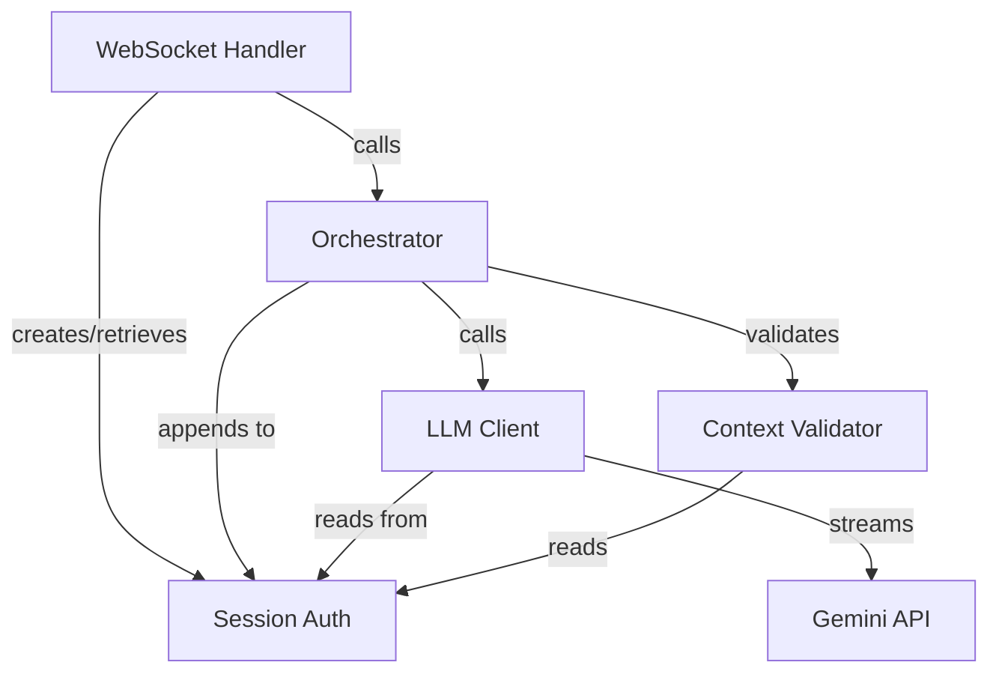

# Design Document: Conversation Context Enhancement

## Overview

The conversation context enhancement feature improves how the Genie AI assistant maintains and manages conversation history within active sessions. The current implementation already maintains an in-memory session history and injects the system prompt before each LLM call, but lacks robust validation, context window management, and assistant message persistence.

This design addresses these gaps by:
- Ensuring assistant responses are properly appended to session history after each turn
- Implementing intelligent context trimming when approaching token limits
- Adding message validation and error recovery mechanisms
- Enhancing language preference tracking across conversations
- Improving observability through debug logging and inspection endpoints
- Maintaining robustness during reconnections and API failures

The enhancement preserves the existing architecture while adding defensive coding practices and better state management to ensure conversational coherence across extended interactions.

## Architecture

### Component Interaction

The conversation context system spans four primary modules:

1. **Session (auth.py)**: Owns the `history` list and session lifecycle management
2. **Orchestrator (orchestrator.py)**: Coordinates turn execution and history updates
3. **LLM Client (llm_client.py)**: Constructs message context and streams completions
4. **WebSocket Handler (main.py)**: Manages connection lifecycle and session retrieval



### Data Flow

A typical multi-turn conversation flows as follows:

1. User sends message via WebSocket
2. WebSocket handler retrieves session and passes to orchestrator
3. Orchestrator appends user message to `session.history`
4. Orchestrator constructs context: `[system_prompt] + session.history`
5. Orchestrator passes context to LLM client for streaming
6. LLM client streams completion chunks back to orchestrator
7. Orchestrator accumulates assistant response and tool calls
8. When turn completes, orchestrator appends assistant message to `session.history`
9. If tool calls were made, orchestrator appends tool_call and tool result messages
10. Context validator runs periodically to check history coherence
11. Context trimmer runs when history exceeds token threshold

### Key Design Decisions

**Decision 1: Message Accumulation Strategy**
- Current code streams text deltas but doesn't accumulate the final assistant message
- Solution: Add a message accumulator that builds the complete assistant message during streaming, then appends it to history after the turn finishes

**Decision 2: Context Trimming Trigger**
- Token counting requires model-specific tokenizers, which adds complexity
- Solution: Use approximate token counting (4 characters ≈ 1 token) with a conservative buffer, supplemented by a message count limit

**Decision 3: Validation Timing**
- Validate on every append would add latency
- Solution: Validate on message append (lightweight checks) and perform comprehensive validation before LLM calls

**Decision 4: Language Preference Storage**
- Adding fields to Session dataclass requires session migration
- Solution: Add `language_preference` and `is_valid` fields to Session dataclass (backward compatible via field defaults)

**Decision 5: System Prompt Injection**
- Current implementation injects system prompt in orchestrator before calling LLM client
- Solution: Keep this pattern but move injection to a helper function for consistency and testability


## Components and Interfaces

### 1. Session Enhancement (auth.py)

**New Fields:**
```python
@dataclass
class Session:
    session_id: str
    token: str
    created_at: float
    last_seen: float
    history: list[dict]
    language_preference: Optional[str] = None  # NEW: "en", "hi", None=auto
    is_valid: bool = True  # NEW: tracks if history is in consistent state
```

**Methods:**
- `touch()` - updates last_seen (exists, no changes)
- `expired(ttl: int) -> bool` - checks TTL (exists, no changes)

No new methods needed; validation and trimming logic lives in orchestrator.

### 2. Context Manager Module (orchestrator.py)

**New Functions:**

```python
def validate_message(msg: dict) -> dict:
    """Validate and normalize a message dict.
    
    Ensures required fields exist:
    - role: "user" | "assistant" | "tool" | "system"
    - content: str | None (required unless tool_calls present)
    - tool_calls: list | None (for assistant messages)
    - tool_call_id: str (for tool messages)
    
    Returns normalized message or raises ValueError for unrecoverable errors.
    """

def detect_language(text: str) -> Optional[str]:
    """Detect if text is Hindi/Hinglish using Unicode range check.
    
    Returns "hi" if Hindi script detected, "en" for English, None for unclear.
    Current implementation checks for Devanagari Unicode range (U+0900-U+097F).
    """

def estimate_token_count(messages: list[dict]) -> int:
    """Approximate token count for a message list.
    
    Uses heuristic: ~4 characters = 1 token.
    Includes tool_calls JSON in estimation.
    Returns conservative upper bound.
    """

def trim_history(
    history: list[dict],
    max_tokens: int,
    min_turns: int = 10
) -> tuple[list[dict], list[dict]]:
    """Trim history to fit within token budget while preserving coherence.
    
    Algorithm:
    1. Calculate current token estimate
    2. If under max_tokens, return unchanged
    3. Remove oldest user+assistant message pairs
    4. Always preserve at least min_turns (most recent)
    5. Never remove partial pairs (orphaned user without assistant)
    
    Returns: (trimmed_history, removed_messages)
    """

def construct_message_context(
    session: Session,
    system_prompt: str
) -> list[dict]:
    """Build the message list for LLM API call.
    
    Validates history coherence and constructs:
    [{"role": "system", "content": system_prompt}, *session.history]
    
    If validation fails, logs error and returns minimal valid context.
    """

def append_to_history(
    session: Session,
    message: dict,
    validate: bool = True
) -> None:
    """Safely append a message to session history with optional validation.
    
    - Validates message structure if validate=True
    - Detects and updates language preference for user messages
    - Updates session.is_valid flag
    - Logs warnings for normalization
    """
```

**Modified Functions:**

`handle_user_turn()` - Enhanced to accumulate and append assistant messages:

```python
async def handle_user_turn(
    session: Session,
    user_text: str,
    emit: Emitter,
    settings: Settings | None = None,
) -> None:
    # ... existing validation ...
    
    # Detect language and update session preference
    lang = detect_language(text)
    if lang and not session.language_preference:
        session.language_preference = lang
    
    # Tag message with language
    lang_tag = f"[Language: {session.language_preference or 'English'}] "
    tagged_text = lang_tag + text
    
    # Append user message with validation
    append_to_history(session, {"role": "user", "content": tagged_text})
    
    # Construct context with trimming if needed
    messages = construct_message_context(session, load_system_prompt())
    
    # Log context size for debugging
    token_est = estimate_token_count(messages)
    log.debug(f"Context: {len(messages)} msgs, ~{token_est} tokens")
    
    # ... existing ReAct loop ...
    
    # NEW: Accumulate assistant response
    assistant_message = {"role": "assistant", "content": "", "tool_calls": []}
    
    for _iteration in range(MAX_TOOL_ITERATIONS):
        iteration_text = []
        
        async for event in llm_client.stream_chat(...):
            if event["type"] == "text_delta":
                delta = event["delta"]
                iteration_text.append(delta)
                assistant_message["content"] += delta
                # ... existing emit ...
                
            elif event["type"] == "tool_call":
                # Store tool call in message structure
                assistant_message["tool_calls"].append({
                    "id": event["id"],
                    "type": "function",
                    "function": {
                        "name": event["name"],
                        "arguments": json.dumps(event["arguments"])
                    }
                })
                # ... existing tool execution ...
        
        # After iteration, if assistant produced content/tools, append it
        if assistant_message["content"] or assistant_message["tool_calls"]:
            msg_to_append = {
                "role": "assistant",
                "content": assistant_message["content"] or None,
            }
            if assistant_message["tool_calls"]:
                msg_to_append["tool_calls"] = assistant_message["tool_calls"]
            
            append_to_history(session, msg_to_append)
        
        if not tool_calls_made:
            break
    
    # ... existing TTS and completion ...
```

`_run_tool_call()` - Modified to use append_to_history:

```python
async def _run_tool_call(...) -> None:
    # ... existing tool execution ...
    
    # Append tool result using helper
    append_to_history(session, {
        "role": "tool",
        "tool_call_id": call_id,
        "name": name,
        "content": result.message,
    })
```

### 3. Debug Endpoints (main.py)

**New REST Endpoints:**

```python
@app.get("/debug/session/{session_id}")
async def debug_session(session_id: str) -> JSONResponse:
    """Return session history for debugging (development only).
    
    Security: Only enable when DEBUG=true in environment.
    Returns: {
        "session_id": str,
        "message_count": int,
        "estimated_tokens": int,
        "language_preference": str | None,
        "is_valid": bool,
        "history": list[dict]  # sanitized (no sensitive data)
    }
    """
    if not settings.debug_mode:
        return JSONResponse({"error": "Debug mode disabled"}, status_code=403)
    
    session = session_by_id(session_id)
    if not session:
        return JSONResponse({"error": "Session not found"}, status_code=404)
    
    return JSONResponse({
        "session_id": session.session_id,
        "message_count": len(session.history),
        "estimated_tokens": estimate_token_count(session.history),
        "language_preference": session.language_preference,
        "is_valid": session.is_valid,
        "history": session.history
    })
```

### 4. Configuration (config.py)

**New Settings:**

```python
class Settings(BaseSettings):
    # ... existing fields ...
    
    # Context management
    context_max_tokens: int = 32000  # Conservative limit for Gemini 2.5
    context_min_turns: int = 10      # Minimum turns to preserve when trimming
    context_trim_enabled: bool = True
    
    # Debug mode
    debug_mode: bool = False  # Enables /debug/* endpoints
```

## Data Models

### Message Structure

The system uses OpenAI-compatible message format:

```python
# User message
{
    "role": "user",
    "content": "[Language: English] open chrome browser"
}

# Assistant text response
{
    "role": "assistant",
    "content": "Opening Chrome now.",
    "tool_calls": None  # or omitted
}

# Assistant with tool call
{
    "role": "assistant",
    "content": None,  # or text before tool call
    "tool_calls": [
        {
            "id": "call_abc123",
            "type": "function",
            "function": {
                "name": "open_app",
                "arguments": "{\"app_name\": \"chrome\"}"
            }
        }
    ]
}

# Tool result
{
    "role": "tool",
    "tool_call_id": "call_abc123",
    "name": "open_app",
    "content": "Opened Chrome successfully"
}

# System prompt (injected, not stored in history)
{
    "role": "system",
    "content": "You are Genie, a helpful AI assistant..."
}
```

### Session State

```python
Session(
    session_id="a3f9c2b1",
    token="kj32nkj...",
    created_at=1700000000.0,
    last_seen=1700000120.0,
    language_preference="en",  # or "hi" or None
    is_valid=True,
    history=[
        {"role": "user", "content": "[Language: English] hello"},
        {"role": "assistant", "content": "Hello! How can I help?"},
        # ... more messages ...
    ]
)
```

### Validation State

Messages are considered valid if:
- They have a `role` field with value in ["user", "assistant", "tool", "system"]
- They have either `content` (string or None) OR `tool_calls` (list)
- Tool messages have `tool_call_id` and `name`
- Assistant messages with tool_calls have valid structure

History is considered coherent if:
- Tool role messages immediately follow assistant messages with matching tool_call
- No orphaned tool messages exist
- Message order is chronological

