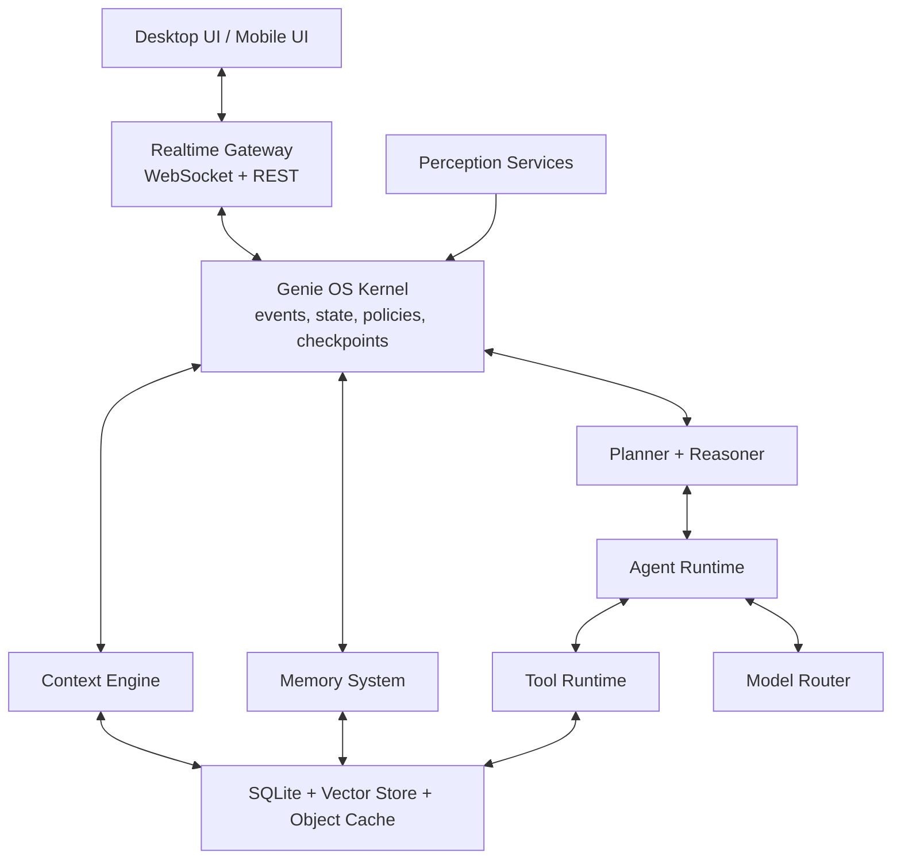
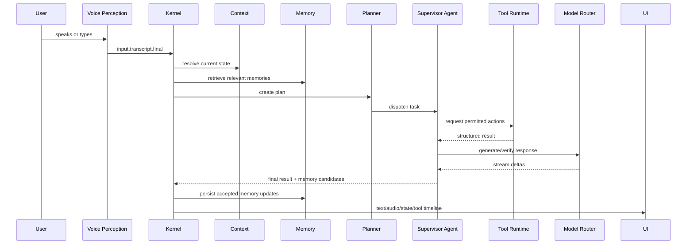
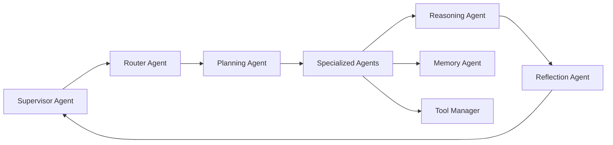

# Genie OS Audit And Architecture Blueprint

Status: design for approval before implementation  
Scope: transform the current Genie assistant into a production-grade, privacy-first AI operating system companion without breaking the existing app.

## Executive Summary

The current project is a capable voice assistant prototype with useful building blocks: FastAPI, WebSocket streaming, tool calling, local STT/TTS options, desktop automation tools, a React orb UI, a SQLite companion memory database, an event bus scaffold, and a backend voice controller. It is not yet an AI operating system because the important subsystems are only partially separated and several are duplicated or disconnected.

The next architecture should keep the working surfaces, but move the product from "chat turn plus tools" to "event-driven operating context plus agents." The highest-risk areas are voice state ownership, memory quality, model routing, tool safety, desktop perception, and testability.

Implementation should happen in phases. Phase 0 is stabilization and compatibility. Phase 1 introduces the OS kernel, event bus, state contracts, and telemetry. Phase 2 moves perception, memory, planning, tools, and agents behind interfaces. Phase 3 adds screen/browser/document intelligence. Phase 4 packages the assistant as a desktop OS companion.

## Current Project Audit

### Existing Strengths

- FastAPI backend with WebSocket protocol and REST `/chat`.
- Streaming LLM path with tool-call support and provider fallback.
- Local GGUF fallback through `services/local_llm.py`.
- Voice controller scaffold with backend-owned state machine.
- React UI with Zustand state and animated orb/face components.
- SQLite companion database with profile, conversations, long-term memory, projects, tasks, preferences, and FTS.
- Tool registry with JSON-schema generation from Python function signatures.
- Desktop automation primitives for apps, URLs, media, clipboard, screen capture, and system controls.
- Health checks, circuit breakers, rate limiting, and structured logging are present in early form.

### Architectural Weaknesses

- Runtime orchestration is centered in `backend/app/orchestrator.py`, which mixes prompt assembly, LLM streaming, tool execution, TTS scheduling, cue parsing, history trimming, memory updates, voice-controller callbacks, and error recovery.
- There are multiple overlapping voice state machines:
  - `backend/app/voice_pipeline.py`
  - `backend/app/services/voice_conversation_controller.py`
  - `frontend/src/store/appStore.js`
  - frontend hook-level voice state mapping
- Memory exists in two competing paths:
  - production SQLite companion DB in `tools/memory_db.py`
  - experimental Qdrant manager in `core/memory/manager.py`
- Qdrant memory uses dummy zero vectors, so semantic retrieval is not real.
- LLM routing exists in two competing paths:
  - `backend/app/llm_client.py`
  - `backend/app/core/llm/router.py`
- The tool system is a registry, but not yet a permissioned plugin system. Tools are imported by side effect and cannot be isolated, streamed, permission-gated, or audited consistently.
- Perception is mostly tool-invoked, not continuous. Screen capture exists as a tool, but there is no perception service maintaining live desktop/browser/app/clipboard context.
- The frontend is visually close to a companion UI, but it is still driven by protocol events from a chat backend, not an OS state model.
- Debug telemetry code is scattered and points to a local debug server.
- Test execution is currently blocked by a broken `.venv` launcher and compiled dependency mismatch.

### Bottlenecks

- LLM and tool loops are serial; there is no dependency graph or concurrent tool scheduler.
- TTS scheduling is inside the main orchestrator turn and competes with tool/LLM logic.
- Context is assembled synchronously per turn instead of continuously maintained by perception workers.
- SQLite is used synchronously from runtime code. This is acceptable for early local use, but long operations should be offloaded or moved behind async repositories.
- Prompt growth is controlled by simple turn trimming, not by summarized memory tiers.
- Browser/screen intelligence requires explicit user or model tool calls, so Genie cannot "always know what the user is doing."

### Scalability Issues

- Single-process globals hold sessions, voice controller, tool registry, rate buckets, model clients, and memory objects.
- No durable job queue for long tasks.
- No backpressure model for perception streams, audio frames, TTS chunks, and tool events.
- No multi-user isolation model beyond PIN/session basics.
- No policy layer for secrets, permissions, tool approvals, destructive actions, or data retention.
- No module boundary between domain logic and FastAPI/WebSocket transport.

### Memory Issues

- SQLite memory has useful schema, but promotion, scoring, compression, and forgetting are minimal.
- Semantic memory scaffold uses dummy vectors, making Qdrant search misleading.
- Conversation messages are saved, but there is no periodic summarizer or topic graph.
- Preferences can be stored, but there is no confidence decay, source tracking policy, or conflict resolution.
- Memory retrieval is not yet a first-class stage in planning.

### Reasoning Limitations

- ReAct-style tool loop exists, but there is no explicit planner, verifier, reflection pass, or confidence model.
- Tool results are returned to the model, but tool success verification is ad hoc.
- No dependency graph for subtasks.
- No durable checkpoints for long-running work.
- No distinction between quick voice answers, research tasks, automation tasks, and coding tasks.

### Voice Limitations

- Backend controller is promising, but audio capture, wake detection, TTS playback, follow-up listening, and barge-in are still fragile because state is mirrored across backend and frontend.
- Streaming STT is not fully implemented as a continuous partial transcript stream.
- Echo cancellation/noise suppression are not represented as explicit services.
- TTS playback completion depends on frontend `playback_complete`, which is correct in principle but needs strict interaction IDs and stale-event rejection everywhere.
- Wake word and speech capture share resources through a custom audio manager, but this needs stronger tests.

### UI Limitations

- The UI has a strong visual direction, but the state model is inconsistent:
  - `orbState`
  - `voiceState`
  - `genieState`
  - `robotEmotion`
- Some visible text is status-oriented rather than companion-oriented.
- No dedicated task/work panel, memory inspector, permission dialog, tool activity timeline, or background context view.
- Browser/document/coding work has no first-class UI surface.

### Code Duplication And Coupling

- Duplicate state machines in backend and frontend.
- Duplicate LLM routing layers.
- Memory duplicated between SQLite and Qdrant paths.
- Voice control logic split between `main.py`, `orchestrator.py`, `voice_pipeline.py`, and `voice_conversation_controller.py`.
- Tool registration is coupled to package import order.
- Debug instrumentation is scattered across frontend and backend.

## Target Architecture

Genie OS should be organized as an event-driven local AI kernel with independent services. The kernel owns state, permissions, event routing, checkpoints, telemetry, and task lifecycle. Agents and tools are plugins on top of the kernel, not hardcoded branches inside the conversation loop.



## Module Design

### 1. OS Kernel

Responsibilities:
- Own event bus, task registry, permissions, checkpoints, state machine, and telemetry.
- Route user input, perception events, tool events, and agent outputs.
- Enforce cancellation, retry, timeout, and backpressure.

Inputs:
- Voice events, UI commands, perception events, timers, tool completions.

Outputs:
- State updates, agent tasks, tool invocations, UI protocol events.

Failure recovery:
- Every task has an ID, deadline, cancellation token, retry policy, and checkpoint.

### 2. Perception Layer

Services:
- Voice perception: wake word, VAD, streaming STT, turn detection.
- Screen perception: screenshots, OCR, active window, UI element detection.
- Clipboard monitor.
- Browser monitor.
- App/window monitor.
- Filesystem/project monitor.
- Camera perception, optional and permission-gated.
- Network/battery/notification monitors.

Rule:
- Perception emits facts. It does not decide what to do.

### 3. Context Engine

Maintains:
- Current task, project, file, folder, app, window, browser tab, website, meeting, clipboard, downloads, active media, recent commands, goals, preferences, and environment.

Responsibilities:
- Merge perception events.
- Keep current context small and high-signal.
- Resolve references like "that", "there", "open it", and "same project".
- Provide prompt packets and agent-readable structured context.

### 4. Memory System

Memory tiers:
- Working memory: current interaction and scratchpad.
- Short-term memory: recent session summaries and current task state.
- Long-term memory: durable user facts, preferences, projects, habits, goals.
- Semantic memory: embedded chunks and retrieved knowledge.
- Episodic memory: timestamped experiences and completed tasks.
- Procedural memory: reusable workflows and automations.
- Knowledge graph: typed entities and relationships.

Storage:
- SQLite for durable relational records and FTS.
- Qdrant or equivalent local vector store for embeddings.
- Object cache for files, screenshots, transcripts, and derived artifacts.

Policies:
- Promote only explicit or high-confidence facts.
- Decay low-value memories.
- Summarize long conversations.
- Keep source, timestamp, confidence, sensitivity, and retention policy.

### 5. Planning Engine

Pipeline:
1. Understand intent.
2. Classify task type.
3. Retrieve context and memories.
4. Create plan and dependency graph.
5. Select agents and tools.
6. Execute with checkpoints.
7. Verify outputs.
8. Reflect on failures.
9. Summarize user-facing result.
10. Update memory.

### 6. Reasoning Engine

Capabilities:
- Plan-and-execute.
- Tree-of-thought internally for complex tasks.
- Reflection and critique.
- Confidence scoring.
- Uncertainty detection.
- Tool-result verification.
- Fact verification for live data.

Policy:
- Quick tasks can use a fast path.
- High-risk or low-confidence tasks must verify before final response.

### 7. Agent Runtime

Agents:
- Supervisor Agent: owns task routing and completion.
- Conversation Agent: natural voice responses.
- Planning Agent: subtasks, dependencies, risk.
- Reasoning Agent: critique, confidence, verification.
- Coding Agent: repo indexing, edits, tests, commits.
- Research Agent: web/retrieval/report generation.
- Browser Agent: visual navigation and form workflows.
- Vision Agent: screen/camera/OCR interpretation.
- Desktop Agent: app/window/input automation.
- Memory Agent: promotion, retrieval, summarization, forgetting.
- Emotion Agent: voice/face/orb affect control.
- Automation Agent: routines, reminders, monitors.
- Scheduling Agent: calendar and time commitments.
- Document Agent: PDF/DOCX/PPTX/XLSX understanding.
- Security Agent: permissions, confirmations, data boundaries.
- Tool Manager: registry, sandbox, retries, audit logs.
- Router Agent: model/tool/agent selection.

Agent contract:
- Inputs: task, context packet, memory packet, permissions, budget.
- Outputs: events, tool requests, state updates, result artifacts.
- Recovery: retry strategy, fallback agent, human clarification.

### 8. Tool Runtime

Every capability becomes a tool plugin.

Tool contract:
- `name`
- `description`
- `input_schema`
- `output_schema`
- `permissions`
- `timeout_ms`
- `retry_policy`
- `streaming`
- `side_effect_level`
- `audit_category`
- `handler`

Permission levels:
- Read-only.
- Local change.
- External network.
- Personal data.
- Destructive.
- Payment/account.

### 9. Model Router

Responsibilities:
- Route by task type, latency, cost, privacy, modality, and offline availability.
- Support cloud and local models.
- Expose streaming, embeddings, vision, audio, and tool-calling capability metadata.
- Use circuit breakers and fallback chains.

Routing examples:
- Wake acknowledgment: local small model or template.
- Desktop command: fast cloud/local tool-calling model.
- Code refactor: high-reasoning cloud model with repo index.
- Private file summary: local model if privacy mode is enabled.
- Live research: cloud model plus browser/research agent.

## Execution Flow



## Agent Communication Flow



## Proposed Folder Structure

```text
backend/
  app/
    os/
      kernel.py
      events.py
      state.py
      tasks.py
      permissions.py
      checkpoints.py
      telemetry.py
    gateway/
      websocket.py
      rest.py
      protocol.py
    perception/
      voice/
      screen/
      browser/
      clipboard/
      files/
      camera/
      desktop/
    context/
      engine.py
      resolvers.py
      snapshots.py
      prompt_packets.py
    memory/
      repository.py
      semantic.py
      episodic.py
      procedural.py
      graph.py
      policies.py
      summarizer.py
    planning/
      planner.py
      dependency_graph.py
      verifier.py
      reflection.py
    agents/
      supervisor.py
      router.py
      conversation.py
      coding.py
      research.py
      browser.py
      vision.py
      desktop.py
      document.py
      automation.py
      security.py
    tools/
      runtime.py
      registry.py
      permissions.py
      audit.py
      plugins/
    models/
      router.py
      providers/
      embeddings.py
      local_runtime.py
    voice/
      controller.py
      stt.py
      tts.py
      vad.py
      wake.py
    storage/
      sqlite.py
      vector.py
      object_store.py
    config/
      settings.py
    tests/
frontend/
  src/
    app/
    gateway/
    state/
    components/
      orb/
      voice/
      task-timeline/
      permissions/
      memory/
      context/
    features/
      desktop/
      documents/
      browser/
      coding/
```

## API Design

### WebSocket Client To Server

```json
{"type":"auth.hello","pin":"1234"}
{"type":"input.text","text":"open my project"}
{"type":"voice.manual_wake"}
{"type":"voice.audio_chunk","interaction_id":"...","format":"pcm16","data":"base64"}
{"type":"voice.audio_end","interaction_id":"..."}
{"type":"task.cancel","task_id":"..."}
{"type":"permission.respond","request_id":"...","approved":true}
{"type":"playback.complete","interaction_id":"..."}
{"type":"context.request_snapshot"}
```

### WebSocket Server To Client

```json
{"type":"auth.ok","session_id":"..."}
{"type":"state.changed","state":"listening","task_id":"..."}
{"type":"voice.transcript.partial","text":"open ch..."}
{"type":"voice.transcript.final","text":"open chrome"}
{"type":"assistant.text.delta","task_id":"...","delta":"Opening Chrome."}
{"type":"assistant.audio.chunk","interaction_id":"...","seq":0,"mime":"audio/mpeg","data":"base64"}
{"type":"tool.started","tool":"open_app","call_id":"..."}
{"type":"tool.completed","tool":"open_app","call_id":"...","status":"ok"}
{"type":"permission.required","request_id":"...","risk":"destructive","description":"Delete file"}
{"type":"memory.updated","memory_id":"...","kind":"preference"}
{"type":"task.completed","task_id":"...","summary":"..."}
{"type":"error","code":"...","message":"..."}
```

### REST Endpoints

- `GET /health`
- `GET /v1/system/status`
- `GET /v1/context/snapshot`
- `GET /v1/memory/search?q=...`
- `POST /v1/tasks`
- `GET /v1/tasks/{task_id}`
- `POST /v1/tasks/{task_id}/cancel`
- `GET /v1/tools`
- `POST /v1/tools/{tool_name}/invoke`
- `GET /v1/permissions/pending`
- `POST /v1/permissions/{request_id}`

## Database Schema

Keep the current SQLite schema as the migration base, but normalize OS concerns.

```sql
CREATE TABLE os_events (
  id INTEGER PRIMARY KEY AUTOINCREMENT,
  event_id TEXT UNIQUE NOT NULL,
  type TEXT NOT NULL,
  source TEXT NOT NULL,
  task_id TEXT,
  payload_json TEXT NOT NULL,
  created_at TEXT NOT NULL
);

CREATE TABLE tasks (
  id TEXT PRIMARY KEY,
  parent_id TEXT,
  title TEXT NOT NULL,
  status TEXT NOT NULL,
  priority INTEGER DEFAULT 0,
  plan_json TEXT,
  result_json TEXT,
  error_json TEXT,
  created_at TEXT NOT NULL,
  updated_at TEXT NOT NULL,
  completed_at TEXT
);

CREATE TABLE context_snapshots (
  id INTEGER PRIMARY KEY AUTOINCREMENT,
  task_id TEXT,
  active_app TEXT,
  active_window TEXT,
  active_url TEXT,
  current_project TEXT,
  clipboard_hash TEXT,
  summary TEXT,
  payload_json TEXT NOT NULL,
  created_at TEXT NOT NULL
);

CREATE TABLE memories (
  id TEXT PRIMARY KEY,
  kind TEXT NOT NULL,
  key TEXT NOT NULL,
  value TEXT NOT NULL,
  source TEXT NOT NULL,
  confidence REAL NOT NULL,
  importance REAL DEFAULT 0.5,
  sensitivity TEXT DEFAULT 'normal',
  retention_policy TEXT DEFAULT 'standard',
  embedding_id TEXT,
  created_at TEXT NOT NULL,
  updated_at TEXT NOT NULL,
  expires_at TEXT
);

CREATE TABLE memory_edges (
  id INTEGER PRIMARY KEY AUTOINCREMENT,
  from_memory_id TEXT NOT NULL,
  to_memory_id TEXT NOT NULL,
  relation TEXT NOT NULL,
  weight REAL DEFAULT 1.0
);

CREATE TABLE tool_calls (
  id TEXT PRIMARY KEY,
  task_id TEXT,
  tool_name TEXT NOT NULL,
  input_json TEXT NOT NULL,
  output_json TEXT,
  status TEXT NOT NULL,
  side_effect_level TEXT NOT NULL,
  started_at TEXT NOT NULL,
  finished_at TEXT,
  error TEXT
);

CREATE TABLE permissions (
  id TEXT PRIMARY KEY,
  task_id TEXT,
  tool_call_id TEXT,
  risk TEXT NOT NULL,
  description TEXT NOT NULL,
  status TEXT NOT NULL,
  decided_at TEXT
);
```

Vector store collections:
- `memory_semantic`
- `conversation_chunks`
- `documents`
- `screenshots`
- `code_symbols`

## Event System

Event envelope:

```json
{
  "event_id": "evt_...",
  "type": "voice.transcript.final",
  "source": "perception.voice",
  "task_id": "task_...",
  "timestamp": "2026-07-16T12:00:00Z",
  "payload": {},
  "privacy": "local",
  "trace_id": "trace_..."
}
```

Core event categories:
- `voice.*`
- `screen.*`
- `browser.*`
- `desktop.*`
- `clipboard.*`
- `file.*`
- `context.*`
- `memory.*`
- `task.*`
- `agent.*`
- `tool.*`
- `model.*`
- `permission.*`
- `ui.*`
- `system.*`

Rules:
- Events are append-only.
- State is derived from events plus snapshots.
- Every tool call and agent decision has a trace ID.
- Sensitive payloads are redacted before logs.

## Migration Plan

### Phase 0: Stabilize The Current App

Goals:
- Keep existing UI and WebSocket protocol running.
- Fix test environment and establish a baseline.
- Remove runtime import traps and stale debug hooks.
- Make one voice state machine authoritative.

Deliverables:
- Working `.venv` or documented runtime bootstrap.
- Passing backend test suite.
- One backend voice controller, one frontend mapping layer.
- Compatibility adapter from old protocol to new event names.

### Phase 1: OS Kernel And Event Contracts

Goals:
- Introduce `app/os` kernel without changing user behavior.
- Route current WebSocket events through the kernel.
- Add task IDs, interaction IDs, trace IDs, cancellation tokens.

Deliverables:
- Event envelope.
- Task registry.
- Permission model.
- Tool audit log.
- State contract tests.

### Phase 2: Memory And Context Engine

Goals:
- Promote SQLite companion DB into a repository layer.
- Replace dummy Qdrant vectors with real embeddings.
- Build context snapshots from clipboard/window/browser/project monitors.
- Add memory promotion, scoring, summarization, and forgetting.

Deliverables:
- Memory repository interface.
- Embedding provider interface.
- Context packet builder.
- Memory quality tests.

### Phase 3: Planner, Agents, Tool Runtime

Goals:
- Split `orchestrator.py` into planner, agent runtime, tool runtime, model router, and response streamer.
- Add tool permission gates and structured retries.
- Add verifier/reflection pass for non-trivial tasks.

Deliverables:
- Supervisor agent.
- Tool runtime with side-effect levels.
- Plan execution graph.
- Agent protocol tests.

### Phase 4: Perception Expansion

Goals:
- Continuous screen, browser, app, clipboard, and project perception.
- User-controlled privacy settings.
- Screen/OCR summaries and active project detection.

Deliverables:
- Perception worker lifecycle.
- Context snapshot UI.
- Browser and desktop agents.
- Privacy dashboard.

### Phase 5: Product UI And Desktop Packaging

Goals:
- Move from chatbot transcript to OS companion interface.
- Add task timeline, tool activity, memory inspector, permission prompts.
- Package with Tauri/Electron after backend contracts stabilize.

Deliverables:
- Holographic orb as first-class state display.
- Permission modal.
- Task timeline.
- Memory/context panels.
- Desktop installer.

## Implementation Approval Gates

Do not begin module implementation until the following are approved:

1. Architecture boundaries.
2. Event protocol.
3. Memory retention and privacy policy.
4. Tool permission levels.
5. Voice state contract.
6. Target packaging strategy.
7. Phase 0 acceptance tests.

## Recommended First Implementation Slice After Approval

Start with Phase 0 and Phase 1 only:

1. Fix Python environment and tests.
2. Create `app/os/events.py`, `app/os/tasks.py`, and `app/os/kernel.py`.
3. Add compatibility adapter for current WebSocket messages.
4. Move task IDs and interaction IDs through voice, orchestrator, TTS, and UI.
5. Add state-machine contract tests.
6. Keep the existing user experience unchanged.

This produces a stable base for the larger Genie OS migration without breaking the current assistant.
